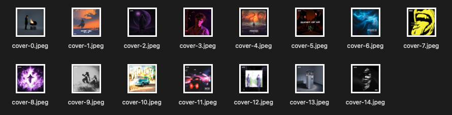
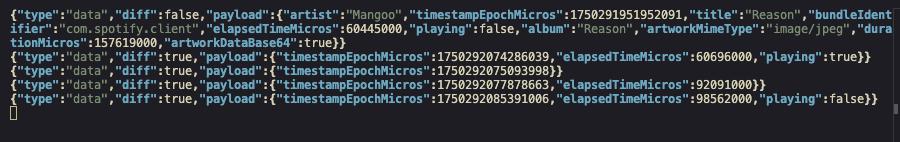

# media-control

Control and observe media playback from the command line.

Available for all macOS versions, including the latest macOS Tahoe.

## Installation and basic usage

```sh
$ brew tap ungive/media-control
$ brew install media-control
```

```sh
$ media-control get                # Get now playing information once
$ media-control stream             # Stream now playing updates in real-time
$ media-control toggle-play-pause  # Toggle playback
$ media-control                    # Print help
```

## Advanced usage

- [Display the current song in your menu bar](#display-the-current-song-in-your-menu-bar)
- [Dump the cover image once](#dump-the-cover-image-once)
- [Dump all cover images continuously during listening](#dump-all-cover-images-continuously-during-listening)
- [Inspect raw data without spamming your terminal](#inspect-raw-data-without-spamming-your-terminal)
- [Watch for song changes](#watch-for-song-changes)
- [Live view of the current timeline position](#live-view-of-the-current-timeline-position)
- [Pause media playback once the current track ends](#pause-media-playback-once-the-current-track-ends)
- [Skip Spotify ads by reopening the app whenever an ad is detected](#skip-spotify-ads-by-reopening-the-app-whenever-an-ad-is-detected)

### Display the current song in your menu bar

You can display your current song using [xbar](https://github.com/matryer/xbar):

  


Copy [the script](./examples/xbar-now-playing.1s.py) to your plugins directory:

```sh
cp ./examples/xbar-now-playing.1s.py ~/Library/Application\ Support/xbar/plugins
chmod +x ~/Library/Application\ Support/xbar/plugins/xbar-now-playing.1s.py
```

Open the xbar app and you should see it appear in your menu bar!

### Dump the cover image once

This saves the cover artwork of the current song
and opens it in the Preview app.

```sh
media-control get | \
    jq -r .artworkDataBase64 | \
    base64 -d > cover && \
    open -a Preview cover

# To determine the file extension:
mv cover "cover.$(file -b cover | sed 's/ .*$//' | tr A-Z a-z)"
```

### Dump all cover images continuously during listening

Watches all changes and saves each new cover to a separate image file.

```sh
index=0; media-control stream | \
    while IFS= read -r line; do \
        if jq -e .payload.artworkDataBase64 <<< "$line" >/dev/null; then \
            jq -r .payload.artworkDataBase64 <<< "$line" | base64 -d > cover; \
            mv cover "cover-$index.$(file -b cover | sed 's/ .*$//' | tr A-Z a-z)"; \
            ((index++)); \
        fi \
    done
```



### Inspect raw data without spamming your terminal

This replaces the base64 encoded image data with `true`, if it has a value.

```sh
media-control stream | \
    while IFS= read -r line; do \
        jq -c 'if .payload.artworkDataBase64 != null then
            .payload.artworkDataBase64 = true
        end' <<< "$line"; \
    done
```



### Watch for song changes

This only prints whenever the song itself is changing,
i.e. either the application, song title, artist or album name.

```sh
media-control stream | \
    while IFS= read -r line; do \
        jq -r 'if .diff == false then
            "\(now | strftime("%H:%M:%S")) (\(.payload.bundleIdentifier
                )) \(.payload.title) - \(.payload.artist)"
        else
            empty
        end' <<< "$line"; \
    done
```

```
18:52:07 (com.spotify.client) Central Park - VELVETEARS
18:54:41 (com.spotify.client) A House Divided - Zander Hawley
18:55:24 (com.spotify.client) redesign - awfultune
18:57:58 (com.spotify.client) look around - Øneheart
```

### Live view of the current timeline position

Displays the current song and updates it in real-time,
including timeline changes:

```sh
/usr/bin/python3 ./examples/now-playing-live.py
```

```
(com.spotify.client) ▶ 00:46/04:58  Happier Than Ever - Billie Eilish
```

### Pause media playback once the current track ends

```sh
index=0; media-control stream | \
    while IFS= read -r line; do \
        if jq -e ".diff == false" <<< "$line" >/dev/null; then \
            if [ "$index" -gt 0 ]; then \
                media-control pause; \
                exit 0; \
            fi; \
            ((index++)); \
        fi \
    done
```

### Skip Spotify ads by reopening the app whenever an ad is detected

No more ads with a vanilla Spotify installation.
This makes use of the fact that with advertisments
the album name is always an empty string.
This script watches for ads, closes the app when an ad is detected,
reopens it and starts playback again.

It's so fast, you don't even notice that it was reopened!

The app opens below other windows, so you don't get disturbed.

```sh
media-control stream --no-diff | \
    while IFS= read -r line; do \
        bundle_id="com.spotify.client"; \
        if jq -e ".payload.bundleIdentifier != \"$bundle_id\"" <<< "$line" >/dev/null; then \
            continue; \
        fi; \
        if jq -e '(.payload.album != "")' <<< "$line" >/dev/null; then \
            continue; \
        fi; \
        echo "Detected advertisement for $bundle_id, closing app"; \
        osascript -e "tell application id \"$bundle_id\" to quit"; \
        while [ "$(osascript -e "application id \"$bundle_id\" is running")" = "true" ]; do \
            sleep 0.1; \
        done; \
        echo "Reopening $bundle_id"; \
        osascript -e "tell application id \"$bundle_id\" to launch"; \
        echo "Waiting for $bundle_id to be the now playing application"; \
        while true; do \
            osascript -e "tell application id \"$bundle_id\" to play"; \
            sleep 0.1; \
            if media-control get | jq -e '.bundleIdentifier == "com.spotify.client"' >/dev/null; then \
                echo "Spotify is now playing"; \
                break; \
            fi; \
        done; \
    done
```

## License

This project is licensed under the BSD 3-Clause License.
See [LICENSE](./LICENSE) for details.

Copyright (c) 2025 Jonas van den Berg
